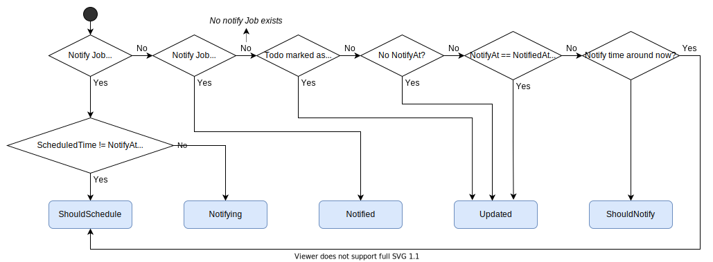

# Building RESTful API using Kubernetes

## Init kubebuilder projects

```
$ kubebuilder init --domain johnliu55.tw --repo johnliu55.tw/todo
```

## Create API using kubebuilder

```
$ kubebuilder create api --group todo --version v1 --kind Todo
```

- Create Resource: y
- Create Controller: y

## Update CRD scheme

Edit `todo/api/v1/todo_types.go`

```go
type TodoSpec struct {
	Summary     string       `json:"summary"`
	Complete    bool         `json:"complete"`
	NotifyEmail string       `json:"notifyEmail,omitempty"`
	NotifyAt    *metav1.Time `json:"notifyAt,omitempty"`
}

type TodoStatus struct {
	Notified bool `json:"notified"`
}
```

## Update config sample

1. Edit `todo/config/samples/todo_v1_todo.yaml`
2. Test it:
    ```
    $ kubectl apply -f todo/config/samples/todo_v1_todo.yaml
    ```

## Update controller

> TODO:
> - Notification job failed
> - Schedule too close

State Machine
### States
- Updated
- ShouldSchedule
- ShouldNotify
- Notifying
- Notified
- ERROR!!!

### Determine states

